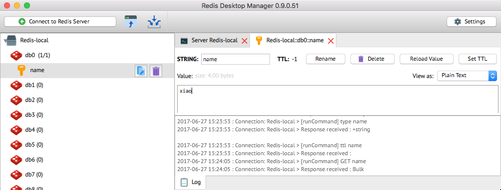

# SpringBootStudy

Spring Boot 的学习项目。

# 1.spring-boot-mybatis

Spring Boot整合MyBatis项目。

测试数据的SQL脚本：

```sql

CREATE TABLE `city` (
  `id` int(11) NOT NULL AUTO_INCREMENT,
  `country` varchar(255) COLLATE utf8mb4_bin NOT NULL,
  `name` varchar(255) COLLATE utf8mb4_bin NOT NULL,
  `state` varchar(255) COLLATE utf8mb4_bin NOT NULL,
  PRIMARY KEY (`id`)
) ENGINE=InnoDB DEFAULT CHARSET=utf8mb4 COLLATE=utf8mb4_bin;

BEGIN;
INSERT INTO `city` VALUES ('1', '中国', '北京', '北京市'), ('2', '中国', '广州', '广东省');
COMMIT;

```
在工程的根目录下，可以看到city.sql。包含结构和数据。

配置SQL连接的账号和密码。

## 运行

启动项目,打开浏览器：

### HomeController

- http://localhost:8080/

### CityController

- http://localhost:8080/citys/1

## 单元测试

运行单元测试。

### HomeControllerTest:

```java

@RunWith(SpringRunner.class)
@SpringBootTest
public class HomeControllerTest {

    private MockMvc mockMvc;

    @Autowired
    WebApplicationContext webApplicationContext;

    @Before
    public void setUp() throws Exception {
        mockMvc = MockMvcBuilders.webAppContextSetup(webApplicationContext).build();
    }

    @Test
    public void greeting() throws Exception {
        mockMvc.perform(get("/"))
                .andDo(print())
                .andExpect(status().isOk())
                .andExpect(jsonPath("message", is("Hello World")));
    }
}
```

### CityControllerTest:

```java

@RunWith(SpringRunner.class)
@SpringBootTest
public class CityControllerTest {

    private MockMvc mockMvc;

    @Autowired
    WebApplicationContext webApplicationContext;

    @Before
    public void setUp() throws Exception {
        mockMvc = MockMvcBuilders.webAppContextSetup(webApplicationContext).build();
    }

    @Test
    public void findCityById() throws Exception {
        mockMvc.perform(get("/citys/1"))
                .andDo(print())
                .andExpect(status().isOk())
                .andExpect(jsonPath("id", is(1)))
                .andExpect(jsonPath("country", is("中国")))
                .andExpect(jsonPath("name", is("北京")))
                .andExpect(jsonPath("state", is("北京市")));
    }
}
```

# 2.spring-boot-druid

Spring Boot 整合阿里的 druid 数据库连接池。

application.properties 中增加druid 数据库连接池配置。

同时 com.jeiker.demo 下增加config 配置。

## 运行

打开地址：

- http://localhost:8080/druid/login.html

使用config 配置中的账号和密码登录： admin , 123456 。

然后访问：

- http://localhost:8080/citys/1

可看到SQL监控页的执行数据：

- http://localhost:8080/druid/sql.html

# 3.spring-boot-jpa

使用Spring Boot Jpa的 demo.

|方法说明|请求方法|URL|
|-----|----|----|
|获取所有城市列表|GET|http://localhost:8080/citys|
|增加城市信息|POST|http://localhost:8080/citys|
|根据id删除城市信息|DELETE|http://localhost:8080/citys/{id}|
|根据id查询城市信息|GET|http://localhost:8080/citys/{id}|
|根据id修改城市信息|PUT|http://localhost:8080/citys/{id}|

# 4.spring-boot-swagger

Spring Boot 整合 Swagger2。

方法列表如 spring-boot-jpa 项目：

## 运行

swagger接口查看：

- http://localhost:8080/swagger-ui.html

# 5.spring-boot-redis

pom.xml文件中引入redis:

```
<dependency>
	<groupId>org.springframework.boot</groupId>
	<artifactId>spring-boot-starter-data-redis</artifactId>
</dependency>
```

application.properties文件中配置redis:

```
# REDIS (RedisProperties)
# Redis数据库索引（默认为0）
spring.redis.database=0
# Redis服务器地址
spring.redis.host=localhost
# Redis服务器连接端口
spring.redis.port=6379
# Redis服务器连接密码（默认为空）
spring.redis.password=
# 连接池最大连接数（使用负值表示没有限制）
spring.redis.pool.max-active=8
# 连接池最大阻塞等待时间（使用负值表示没有限制）
spring.redis.pool.max-wait=-1
# 连接池中的最大空闲连接
spring.redis.pool.max-idle=8
# 连接池中的最小空闲连接
spring.redis.pool.min-idle=0
# 连接超时时间（毫秒）
spring.redis.timeout=0
```

测试用例中使用

```java

@RunWith(SpringRunner.class)
@SpringBootTest
public class SpringBootRedisApplicationTests {

	@Autowired
	private StringRedisTemplate stringRedisTemplate;

	@Test
	public void testRedis() throws Exception {
		// 保存字符串
		stringRedisTemplate.opsForValue().set("name", "xiao");
		// 查出字符串
		Assert.assertEquals("xiao", stringRedisTemplate.opsForValue().get("name"));
	}

}
```

本地启动redis:

```
redis-server
```

## 运行

运行测试用例。

查看Redis Server里的数据：（这里使用redis界面工具）




# 6.spring-boot-ramq

Spring Boot 配合 RabbitMQ。

## 安装

Mac下安装

```
brew install rabbitmq
```

安装目录：

```
/usr/local/sbin
```

启动：

```
rabbitmq-server
```

开启Web管理插件

```
rabbitmq-plugins enable rabbitmq_management
```

打开浏览器

http://localhost:15672/

账号，密码都为：guest

## 项目配置


application.properties文件中配置rabbitmq:

```
# rabbitmq configuration
spring.application.name=rabbitmq-test

spring.rabbitmq.host=localhost
spring.rabbitmq.port=5672
spring.rabbitmq.username=guest
spring.rabbitmq.password=guest
```

## 运行

运行测试用例：

```java

@RunWith(SpringRunner.class)
@SpringBootTest
public class SpringBootRamqApplicationTests {

	@Autowired
	private Producer producer;

	@Test
	public void hello() throws Exception {
		// 生产者: 生产消息
		producer.send();
	}

}
```

打开浏览器查看队列结果：

- http://localhost:15672/


查看工程日志输出：


